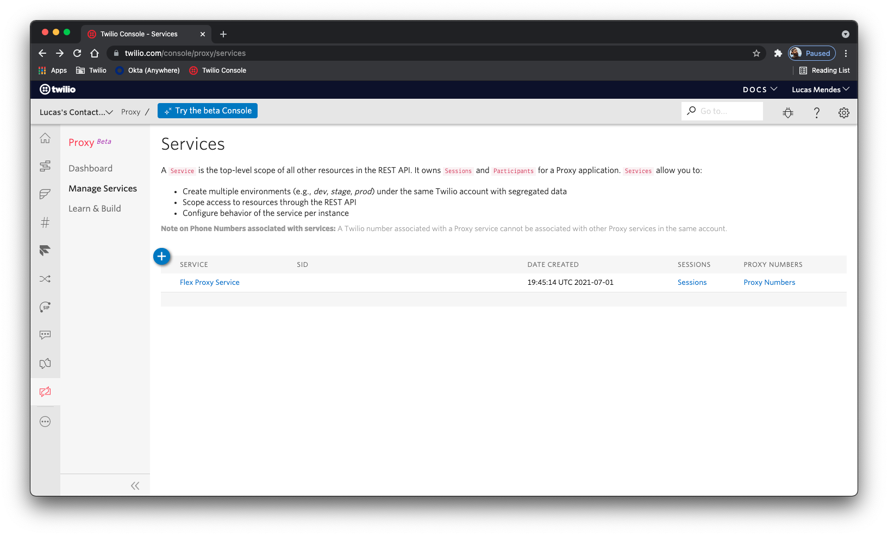

# Simple Messaging Interception Middleware

This project is a simple NodeJS application that is aimed to be used as a middleware to catch and log message details using the Intercept Callback URL on Twilio Proxy. This project can be used as a base project to catch these messages and save it on an external location, get informational logs and so on.

## Requirements

- NodeJS 16.4 or greater
- NPM 7.18 or greater

## Installation and Setup

### Cloning the project

The first thing you need to do, is to clone this repository and setup it locally on a webserver.

```
git clone https://github.com/devsdmf/simple-messaging-middleware.git 
```

### Installing Dependencies

Now you need to install the project dependencies using NPM:
```
cd /path/to/the/project
npm install
```

### Environment Variables

The project uses the [Twilio SDK for NodeJS](https://www.twilio.com/docs/libraries/node), and it needs the account credentials in order to fetch some additional information from the Twilio services, so, the easiest way to configure this credentials is to clone the sample `.env` file and update it with your account values.

```
cd /path/to/the/project
cp .env.sample .env && edit .env
```

The `.env` file should have the both `TWILIO_ACCOUNT_SID` and `TWILIO_ACCOUNT_TOKEN` variables.

### Starting up the server

The project offers an npm script to easily start the development server (`npm start`) but if you want, you can also execute the `app.js` source directly.

### Exposing a development server

If you don't want to deploy it on a webserver or just want to play with the code, you can use [ngrok](https://ngrok.com/) to expose a local tunnel from your machine to the internet.

### Setting up Proxy

As soon as you have a public accessible URL, go ahead to your [Twilio Proxy Services](https://www.twilio.com/console/proxy/services), and select the service you want the middleware to be attached to.



Then on the Proxy Service details screen, fill the _INTERCEPT CALLBACK URL_ field with the URL and endpoint for your service, i.e.: https://my.middlware.com/messaging


That's it, now just save your changes on this screen and you are ready to go!

## Customizing the Middleware

The middleware code is pretty simple, the idea is to receive the Twilio Proxy's events and do something with that information. By default, the script only writes a log to the STDOUT, but you can change the `saveMessage` method in order to accept more information, and do something else with that information, i.e., saving in a database, send it to a queue or just log the messages to an external log aggregator.

## Disclaimer

This software is to be considered "sample code", a Type B Deliverable, and is delivered "as-is" to the user. Twilio bears no responsibility to support the use or implementation of this software.

## License

This project is licensed under the [MIT license](LICENSE), that means that it is free to use, copy and modify for your own intents.
